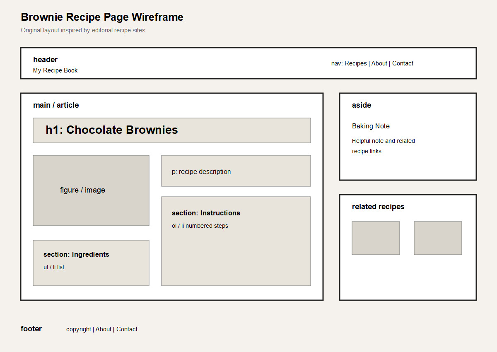

# Brownie Recipe Page Wireframe



This visual wireframe is an original layout based on the Food52 site-map
research. It is a plan for my own brownie recipe page, not a screenshot or
copy of the Food52 website.

```text
+--------------------------------------------------+
| header: site name | Recipes | About | Contact   |
+--------------------------------------------------+
| main                                             |
|  +--------------------------------------------+  |
|  | article: recipe                            |  |
|  |  h1: Chocolate Brownies                    |  |
|  |  figure: recipe image                      |  |
|  |  p: recipe description                     |  |
|  |  section: Ingredients                      |  |
|  |  section: Instructions                     |  |
|  +--------------------------------------------+  |
|                                                  |
|  aside: baking note and related recipes          |
+--------------------------------------------------+
| footer: copyright | About | Contact             |
+--------------------------------------------------+
```

The main content is an `article`. The ingredients and instructions are separate
`section` elements. The baking note belongs in an `aside` because it supports
the main recipe without being part of the instructions.
